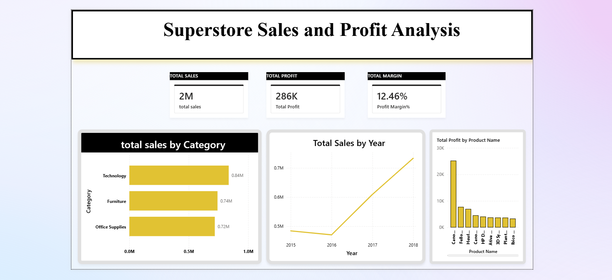
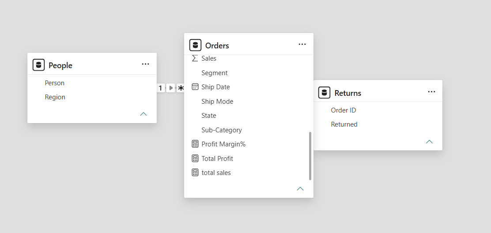

# Superstore Sales and Profit Analysis

An interactive Power BI dashboard designed to analyze and extract actionable insights from Global Superstore transaction data. This project tracks key performance indicators (KPIs) across sales, profits, and profit margins to identify top-performing product categories and yearly growth trends.

---

## 📄 Dashboard Preview


## 🗄️ Data Model Structure


---

## 🚀 Key Features & Insights
* **Executive KPIs:** Clean tracking of Total Sales ($2M), Total Profit ($286K), and an optimized Profit Margin (12.46%).
* **Category Performance:** Highlighting that **Technology** drives the highest total sales compared to Furniture and Office Supplies, complete with custom data labels for precise viewing.
* **Growth Trend:** Visualized an upward sales trajectory from 2016 through 2018 using a clear trend analysis.

---

## 🛠️ Tech Stack & Skills Used
* **Data Modeling:** Established a clean relationship structure between transactional tables and data entities.
* **DAX (Data Analysis Expressions):** Wrote explicit custom measures for key business metrics:
  ```dax
  Total Profit = SUM(Orders[Profit])
